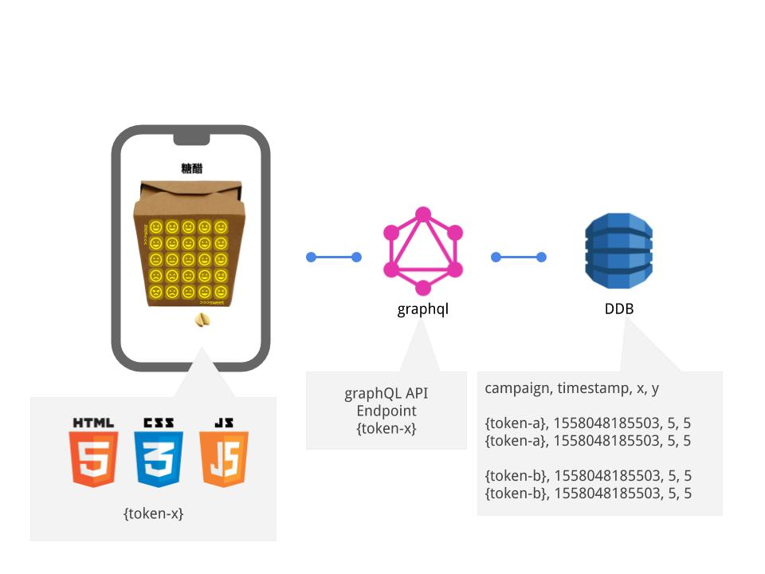

sweet-n-sour
===================
#### A simple ONE click feedback tool. 

## The problem
Surveys take too long, 1-5 star feedback is too narrow, for example if the food was rubbish but the service was great, the human suffers.

## The solution
A ONE click feed back two with two dimensions, for example...

__Takeout__
Sweet, Sour

__Coffee__
Speed, Taste

__Product__
Performance, Support

__Pizza__
Toppings, Temperature


```js
const ssapi = { endpoint: 'https://yourendpoint.appsync-api.ap-southeast-2.amazonaws.com/graphql', 
  token: 'da2-yourtoken' }
```



