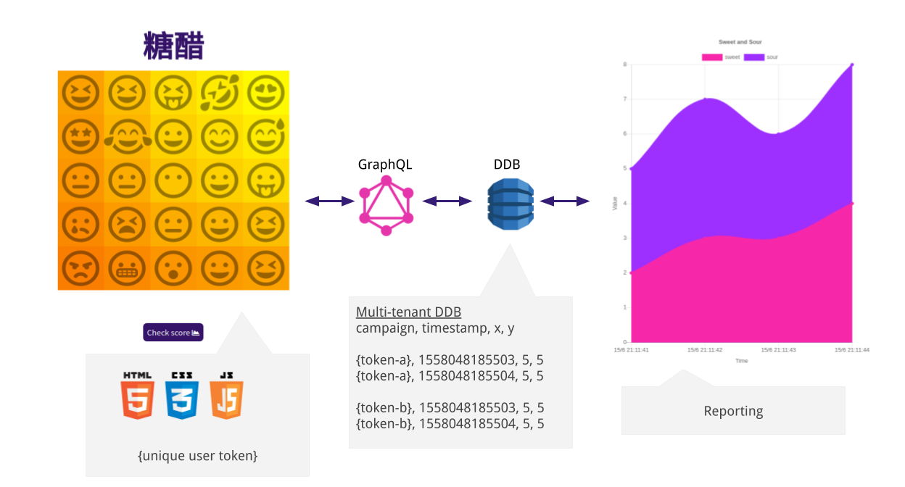

sweet-n-sour
===================

#### A ONE click feedback tool. 

## The problem
Surveys take too long, five star feedback is too narrow not taking into account the range of possibilities.

## The solution
A ONE click feed back tool with all kinds of emotions, you choose.

## Score
Results are recorded via (GraphQL) as x/y coordinates and open to interpretation.

## Tokens
This is just a draft, if I had (more) time a token (or oauth) page could be used to provide a multi-tennant app.  The back-end data structure already supports this.


```js
const ssapi = { endpoint: 'https://yourendpoint.appsync-api.ap-southeast-2.amazonaws.com/graphql', 
  token: 'da2-yourtoken' }
```



